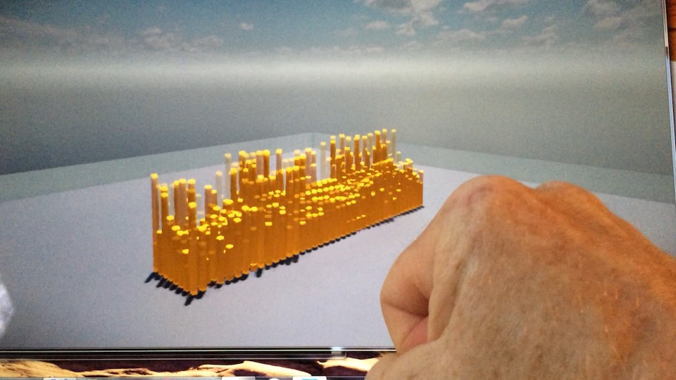

# Stingray Myo Plugin

This is a Stingray plugin for the Thalmic Myo armband.

[]

# Dependencies

- Myo SDK (Windows) v0.9.0
- Autodesk Stingray v1.4 (source code)

# Setup

1. Place the plugin's project files in the Stingray build folder:

<pre>.\\runtime\\plugins\\myo_plugin</pre>

2. Install the Myo v0.9.0 SDK (Windows only for now) into your Stingray libraries folder where all 3rd party dependencies are found.  For example:

<pre>%SR_LIB_DIR%\\myo-sdk-win-0.9.0</pre>

3. Edit <pre>make.rb</pre>

<pre>	
	if $options[:myo] == nil
		command += " --use-myo"
	end
</pre>

4. <pre>make_options.rb</pre>

<pre>
	opts.on("--[no-]use-myo", "Enable Myo plug-in support") { |v| options[:myo] = v }
</pre>

5. <pre>make_switch.rb</pre>

<pre>
	content += get_cmake_set_command("ENGINE_USE_MYO", $options[:myo])
</pre>

and

<pre>
	command << "myo" if $options[:myo]
</pre>

6. <pre>.\\runtime\\CMakeLists.txt</pre>

<pre>
	# Myo plug-in
	if( ENGINE_USE_MYO )
		find_package(Myo REQUIRED)
		add_compile_options(-DHAS_MYO)
		install(FILES ${MYO_BINARIES} DESTINATION "${ENGINE_INSTALL_DIR}")
	endif()
</pre>

and

<pre>
	if( ENGINE_USE_MYO )
		add_subdirectory(${PROJECT_SOURCE_DIR}/plugins/myo_plugin)
	endif()
</pre>

7. Copy the <pre>.\\myo_plugin\FindMyo.cmake</pre> file into the <pre>.\\cmake</pre> folder.

# Building

Build Stingray using the command:

<pre>make.rb</pre>

This will also build the Myo Plugin.  Once built, the namespace "stingray.Myo" will be avilable for use in Stingray through LUA.

# LUA Myo API

TODO documentation
